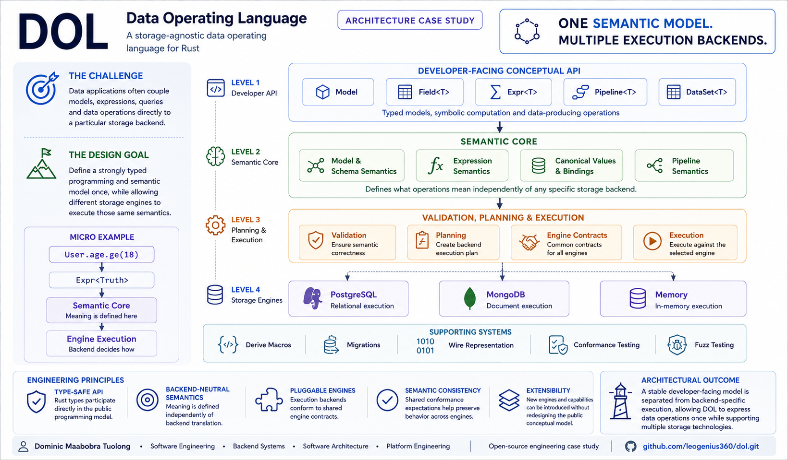

# DOL Architecture

## North star

DOL is a Rust-native semantic language for querying, transforming, analyzing, computing on, changing, streaming, and intelligently processing data. Execution placement is a separate concern.



## Non-negotiable boundaries

1. `dol-core` defines **what an operation means**.
2. `dol-engine` defines whether and where an engine can execute that meaning.
3. Engine crates define **how** a backend physically implements assigned work.
4. Backend SQL, BSON, collection names, indexes, and physical types never enter logical model definitions.
5. Local evaluation becomes the normative executable oracle before remote backends determine language shape.
6. Semantic equivalence, not operator-name similarity, determines exact capability support.
7. Hybrid execution is bounded and explicit; remote execution does not silently download arbitrary data.
8. `Insert`, `InsertMany`, `Update`, and `Delete` remain distinct first-class operations.
9. Unscoped destructive operations do not become executable until explicitly scoped or acknowledged with `.all()`.
10. Compact arenas, interning, Arrow, SIMD, and other representation optimizations remain private and benchmark-driven.
11. `DataSet<T>` is the concrete eager oracle; it does not turn into another symbolic plan type.
12. Local updates use simultaneous assignment semantics and commit atomically only after record/constraint validation.
13. Reverse Rust materialization is explicit (`DataValue::from_datum` / `SemanticBinding::from_datum`) and never inferred from representation alone.
14. Engine capability support means semantic equivalence, never merely a similarly named backend operator.
15. `RemoteOnly` is the safe placement default; hybrid data movement requires an enforceable explicit transfer budget.
16. Runtime parameter values are separate from logical plan/write identity.

## Crate rule

A crate must be independently useful, opt-in at the facade, required by Rust as a technical package boundary, or be repository tooling. Internal modularity alone does not justify a crate.

That is why models, expressions, pipelines, analytics, writes, runtime models, logical plans, and local semantics are modules inside `dol-core`.


## Public conceptual core

DOL protects a deliberately small public mental model:

```text
Model       describes data
Field<T>    references one typed model value
Expr<T>     symbolically computes one value
Pipeline<T> symbolically computes data
DataSet<T>  contains concrete/materialized data
```

`Query` and `Transform` are roles/terminology, not parallel public Rust
abstractions. A pipeline is declarative and lowers to a logical DAG; it must not
be implemented as an imperative linear stage runner. Unary, join, and set
topology stay behind the same `Pipeline<T>` abstraction. See the
[pipeline guide](pipelines.md).

## Execution lifecycle

```text
typed public operation
        |
        v
normalize
        |
        v
semantic validation
        |
        v
logical optimization
        |
        v
capability analysis
        |
        v
placement / partition
        |
        v
physical compilation
        |
        v
physical optimization
        |
        v
stream execution
        |
        v
typed decode
        |
        v
optional bounded residual execution
```

The architecture deliberately avoids a universal physical IR. Engines consume
validated logical plans through an [exact-capability SPI](engine-spi.md) and may
introduce backend-private physical forms only when execution makes them
measurable. The memory engine remains the normative differential oracle. JSONL,
PostgreSQL, and MongoDB expose narrower adapter-owned mappings and compilers and
reject semantics outside their advertised surfaces. A hidden read-only
prepared-expression view exists solely so engine crates can compile semantics
without exposing authoring IR or parsing display strings.
## Expression kernel

The public expression language follows two invariants:

- `Field<T>` carries the Rust/DOL value type only; model ownership is semantic metadata and pipeline scope is resolved during binding.
- `Expr<T>` always means an expression whose semantic result type is `T`. Conditional expressions therefore use `Expr<Truth>` rather than a separate `Predicate` type.

Authoring expressions lower into a private flat prepared representation before evaluation or future engine compilation. Local `ExprId`, `ScopeId`, and dense field slots remain compiler/execution mechanics and never participate in semantic identity. Canonical expression fingerprints use stable model/field lineage, exact `TypeDef` semantics, canonical `Datum` values, and versioned operation semantics.


## Semantic contract baseline

DOL 0.1 requires `std` and uses Rust types as the public static type system while
`TypeDef` provides portable semantic meaning after Rust generic information is
erased. `TypeKey` identifies semantic lineage; exact canonical definitions use
full BLAKE3 fingerprints. Foreign Rust types are adapted through
`SemanticBinding<T>` rather than `type_name`, `Debug`, or a closed extension
enum. See the [data-model contract](data-model.md) and
[ADR-0001](../adr/0001-semantic-contract-lock.md) /
[ADR-0002](../adr/0002-std-baseline.md).

## Type-owned expression APIs

`Field<T>` and `Expr<T>` are symbolic `T`, not a DOL-owned replacement type system. DOL core owns expression composition, binding, normalization, fingerprints, and portable function identity; semantic Rust types own their method vocabulary through extension traits over `ExprSource<Value = T>`. Built-in text, numeric, and temporal APIs use the same extension mechanism available to application and foreign types. See ADR-0004.

Methods that can lower into existing DOL algebra do so directly. A genuinely primitive domain operation uses `SemanticFunction`: its `FunctionDef` is portable semantic data while local validation/evaluation dispatch remains private and is excluded from fingerprints. Engines match the semantic definition and exact typed call, not a Rust callback or similarly named backend function.

## Expression function boundary

Portable functions are semantic data, not opaque Rust callbacks. `FunctionDef` contains a stable key, version, determinism, and semantic dependencies. `SemanticFunction` supplies local conformance hooks for primitive custom operations, but those hooks are execution machinery and never portable identity. Conflicting definitions claiming the same function key/version are rejected during expression validation.
